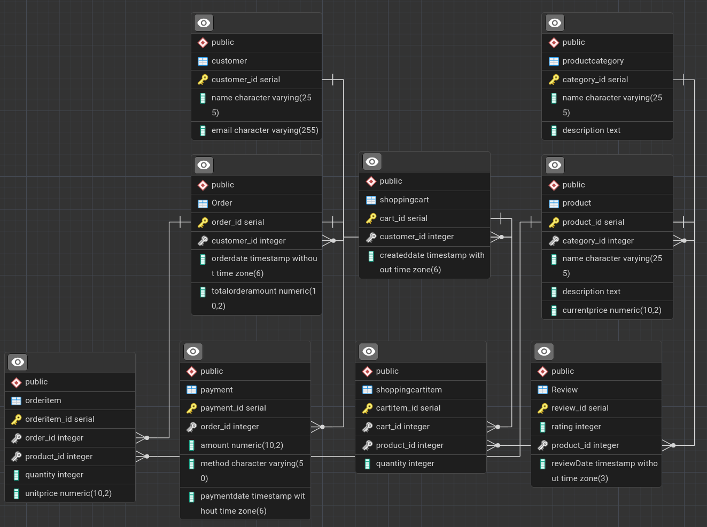

# Документація схеми бази даних

## Діаграма сутність-зв'язок (ERD)

-----

## Опис таблиць

### Таблиця: `customer`

**Призначення:** Зберігає персональні дані клієнтів магазину.

| Стовпець | Тип | Обмеження | Опис |
|----------|-----|-----------|------|
| customer\_id | INT | PRIMARY KEY, SERIAL | Унікальний ідентифікатор клієнта |
| name | VARCHAR(255) | NOT NULL | Повне ім'я клієнта |
| email | VARCHAR(255) | UNIQUE, NOT NULL | Електронна пошта (логін) |

**Індекси:**

  - `customer_email_key` на `email` (Унікальний індекс для швидкого пошуку та запобігання дублікатам).

**Зв'язки:**

  - Один-до-багатьох з `Order` (клієнт може мати історію замовлень).
  - Один-до-багатьох з `shoppingcart` (клієнт може мати кошик).

-----

### Таблиця: `productcategory`

**Призначення:** Довідник категорій для класифікації товарів.

| Стовпець | Тип | Обмеження | Опис |
|----------|-----|-----------|------|
| category\_id | INT | PRIMARY KEY, SERIAL | Ідентифікатор категорії |
| name | VARCHAR(255) | NOT NULL | Назва категорії (наприклад, "Електроніка") |
| description | TEXT | NULL | Опис категорії |

**Зв'язки:**

  - Один-до-багатьох з `product` (категорія містить багато товарів).

-----

### Таблиця: `product`

**Призначення:** Зберігає інформацію про товари, доступні для продажу.

| Стовпець | Тип | Обмеження | Опис |
|----------|-----|-----------|------|
| product\_id | INT | PRIMARY KEY, SERIAL | Ідентифікатор товару |
| category\_id | INT | FOREIGN KEY | Посилання на категорію |
| name | VARCHAR(255) | NOT NULL | Назва товару |
| description | TEXT | NULL | Детальний опис товару |
| currentprice | DECIMAL(10,2) | NOT NULL | Поточна ціна за одиницю |

**Зв'язки:**

  - Багато-до-одного з `productcategory` (`ON DELETE SET NULL`).
  - Один-до-багатьох з `orderitem`, `shoppingcartitem`, `Review`.

-----

### Таблиця: `shoppingcart`

**Призначення:** Тимчасове сховище для сесії покупок користувача.

| Стовпець | Тип | Обмеження | Опис |
|----------|-----|-----------|------|
| cart\_id | INT | PRIMARY KEY, SERIAL | Ідентифікатор кошика |
| customer\_id | INT | FOREIGN KEY | Власник кошика |
| createddate | TIMESTAMP | DEFAULT NOW() | Дата створення кошика |

**Зв'язки:**

  - Багато-до-одного з `customer` (`ON DELETE CASCADE` - видалення клієнта видаляє кошик).
  - Один-до-багатьох з `shoppingcartitem`.

-----

### Таблиця: `shoppingcartitem`

**Призначення:** Зв'язує товари з кошиком, зберігаючи бажану кількість.

| Стовпець | Тип | Обмеження | Опис |
|----------|-----|-----------|------|
| cartitem\_id | INT | PRIMARY KEY, SERIAL | Ідентифікатор запису |
| cart\_id | INT | FOREIGN KEY | Посилання на кошик |
| product\_id | INT | FOREIGN KEY | Посилання на товар |
| quantity | INT | DEFAULT 1 | Кількість одиниць товару |

**Зв'язки:**

  - Багато-до-одного з `shoppingcart` (`ON DELETE CASCADE`).
  - Багато-до-одного з `product` (`ON DELETE CASCADE`).

-----

### Таблиця: `Order`

**Призначення:** Фіксує факт підтвердженої покупки.

| Стовпець | Тип | Обмеження | Опис |
|----------|-----|-----------|------|
| order\_id | INT | PRIMARY KEY, SERIAL | Ідентифікатор замовлення |
| customer\_id | INT | FOREIGN KEY | Замовник |
| orderdate | TIMESTAMP | DEFAULT NOW() | Дата оформлення замовлення |
| totalorderamount | DECIMAL(10,2) | NOT NULL | Загальна сума замовлення (кешована) |

**Зв'язки:**

  - Багато-до-одного з `customer`.
  - Один-до-багатьох з `orderitem`.
  - Один-до-одного з `payment`.

-----

### Таблиця: `orderitem`

**Призначення:** Деталізація замовлення. Зберігає "знімок" ціни на момент покупки.

| Стовпець | Тип | Обмеження | Опис |
|----------|-----|-----------|------|
| orderitem\_id | INT | PRIMARY KEY, SERIAL | Ідентифікатор позиції |
| order\_id | INT | FOREIGN KEY | Посилання на замовлення |
| product\_id | INT | FOREIGN KEY | Посилання на товар |
| quantity | INT | NOT NULL | Кількість купленого товару |
| unitprice | DECIMAL(10,2) | NOT NULL | Ціна за одиницю на момент покупки |

**Зв'язки:**

  - Багато-до-одного з `Order` (`ON DELETE CASCADE`).
  - Багато-до-одного з `product`.

-----

### Таблиця: `payment`

**Призначення:** Інформація про транзакцію оплати.

| Стовпець | Тип | Обмеження | Опис |
|----------|-----|-----------|------|
| payment\_id | INT | PRIMARY KEY, SERIAL | Ідентифікатор оплати |
| order\_id | INT | UNIQUE, FOREIGN KEY | Посилання на оплачене замовлення |
| amount | DECIMAL(10,2) | NOT NULL | Сума транзакції |
| method | VARCHAR(50) | NULL | Метод оплати (Card, PayPal тощо) |
| paymentdate | TIMESTAMP | DEFAULT NOW() | Час проведення оплати |

**Індекси:**

  - `payment_order_id_key` (Унікальний індекс, що гарантує 1 платіж на 1 замовлення).

**Зв'язки:**

  - Один-до-одного з `Order`.

-----

### Таблиця: `Review`

**Призначення:** Відгуки та рейтинги товарів.

| Стовпець | Тип | Обмеження | Опис |
|----------|-----|-----------|------|
| review\_id | INT | PRIMARY KEY, SERIAL | Ідентифікатор відгуку |
| rating | INT | NOT NULL | Оцінка (зазвичай 1-5) |
| product\_id | INT | FOREIGN KEY | Оцінюваний товар |
| reviewDate | TIMESTAMP | DEFAULT NOW() | Дата відгуку |

-----

## Рішення щодо дизайну

### 1\. Структура схеми

Було обрано класичну реляційну модель для онлайн магазина. Використання PostgreSQL забезпечує сувору типізацію та цілісність даних, що є критичним для фінансових операцій (замовлення, платежі).

### 2\. Рівень нормалізації

Схема відповідає **Третій нормальній формі (3NF)**:

  - Всі атрибути залежать від первинного ключа.
  - Відсутні групи, що повторюються.
  - **Виключення (Денормалізація):** Поле `totalorderamount` в таблиці `Order` є надлишковим, оскільки його можна обчислити, просумувавши `orderitem`. Воно збережено для оптимізації продуктивності читання (щоб не робити `SUM()` при кожному запиті історії замовлень).

### 3\. Компроміс

У таблиці `orderitem` дублюється поле `unitprice`.

  - **Проблема:** Якщо змінити `currentprice` в таблиці `product`, це не повинно впливати на існуючі замовлення.
  - **Рішення:** При створенні замовлення ціна копіюється з `product` в `orderitem`. Це гарантує, що фінансова звітність залишається точною незалежно від майбутніх змін цін.

### 4\. Видалення даних

  - Для **Кошиків** (`shoppingcart`, `shoppingcartitem`) використовується `ON DELETE CASCADE`. Якщо користувач або товар видаляється, кошик очищається автоматично, оскільки це тимчасові дані.
  - Для **Замовлень** (`Order`) видалення обмежене (`NoAction` для `customer`), щоб зберегти історію продажів навіть якщо обліковий запис клієнта деактивовано.

### 5\. Типи даних

Для цін використано `DECIMAL(10, 2)` замість `FLOAT` чи `DOUBLE`. Це стандартна практика для фінансових систем, щоб уникнути помилок округлення чисел з плаваючою крапкою.

### 6\. Стратегія індексування

  - **Primary Keys:** Автоматично індексуються (B-Tree).
  - **Unique Constraints:** Поля `email` (customer) та `order_id` (payment) мають унікальні індекси для швидкого пошуку та забезпечення логіки "один-до-одного".